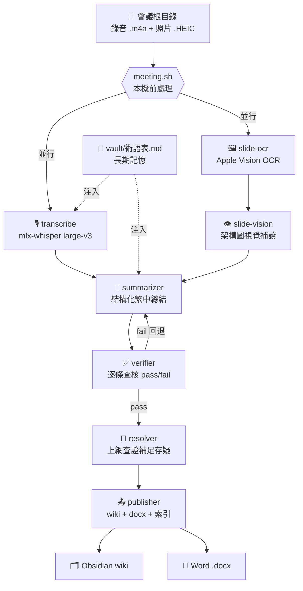

# meeting-harness — 會議總結 Agent Team（可沿用）

把一場會議/研討會/課程的**錄音 + 投影片照片**，一鍵變成：乾淨繁中逐字稿 → 投影片文字 → 結構化總結 → Obsidian wiki 頁 → Word（.docx）。獨立自包含、指向任一會議目錄即可執行，未來每場沿用。

## 目錄
```
meeting-harness/
├─ bin/                 # 可重跑的本機工具
│  ├─ meeting.sh        # ★ 前門啟動器（doctor / prep / status）
│  ├─ init-vault.sh     # 從 seeds/ 建立本機 vault
│  ├─ transcribe.sh     # mlx-whisper large-v3 → 逐字稿（fallback openai-whisper；含防迴圈偵測）
│  ├─ ocr-slides.sh + _ocr.py   # sips HEIC→JPG + Apple Vision(ocrmac) OCR
│  ├─ to-docx.sh        # pandoc md→docx
│  ├─ publish.py        # 發佈 wiki + docx + 索引（自動移除來源標註）
│  └─ _strip_cit.py, _state.py  # 內部小工具
├─ .claude/
│  ├─ agents/           # 7 個專職 subagent
│  ├─ skills/           # meeting-summary(orchestrator) + 4 子任務 skill（SKILL.md，npx skills find 可索引）
│  └─ workflows/meeting-pipeline.js   # 確定性編排引擎（可觀測/可恢復）
├─ seeds/               # 乾淨 vault 種子（術語表 / 會議索引 範本）
├─ vault/               # Obsidian wiki + 長期記憶（不進版控）
└─ config.json
```

## 流水線



## 一次性安裝
```bash
pip install mlx-whisper ocrmac      # Apple Silicon 本機、離線（首跑 large-v3 下載約 3GB）
brew install pandoc
# find-skill 用 npx，免安裝：npx skills find <關鍵字>
bash bin/init-vault.sh              # 從 seeds/ 建立本機 vault（wiki + 長期記憶）
bash bin/meeting.sh doctor          # 檢查工具鏈
```

> 注意：`vault/`（Obsidian wiki 與長期記憶，含實際會議內容）**不進版控**（見 `.gitignore`）——屬個人/機密資料，由 `init-vault.sh` 從 `seeds/` 在本機生成。

## 每場會議的資料擺法
```
<會議根目錄>/<場次名稱>/
├─ 錄音/<場次>.m4a          # 必要
├─ 錄音/轉文字.txt           # 選配：現場粗轉錄（用於術語校對）
└─ 照片/*.HEIC              # 投影片照片
```

## 用法（兩步）
```bash
# 1) 本機前處理（轉錄 + OCR，可重跑、冪等）
bash bin/meeting.sh "<會議根目錄>"

# 2) AI 步驟：在 Claude Code 執行（逐字稿精修→總結→驗證→發佈 wiki+docx）
#    /meeting-summary "<會議根目錄>"

# 看狀態
bash bin/meeting.sh status "<會議根目錄>"
```

## 範例輸出（示意，非真實會議）

**① 檢查工具鏈** — `meeting doctor`
```text
== meeting-harness doctor ==
✓ mlx-whisper
✓ ocrmac (Apple Vision)
✓ pandoc
✓ sips
✓ ffmpeg
✓ npx (find-skill: npx skills find)
```

**② 本機前處理** — `meeting "~/會議/2026-Q3-技術分享"`
```text
== 會議根目錄：~/會議/2026-Q3-技術分享 ==

── [1] 微服務可觀測性實作 ──
  ▶ 轉錄：.../錄音/微服務可觀測性實作.m4a
[transcribe] engine=mlx-whisper model=large-v3 ...
[transcribe] DONE -> .../錄音/transcript.raw.md (912 lines; max-line-repeat=6)
  ▶ 投影片 OCR：.../照片
[ocr] 24 images ready; running Apple Vision OCR
[ocr] DONE -> .../照片/.ocr

── [2] 資料管線重構 ──
  ▶ 轉錄：.../錄音/資料管線重構.m4a
[transcribe] DONE -> .../錄音/transcript.raw.md (1043 lines; max-line-repeat=8)
  ▶ 投影片 OCR：.../照片
[ocr] DONE -> .../照片/.ocr

════════════════════════════════════════════════════
✅ 本機前處理完成（2 場）。接著在 Claude Code 執行：
    /meeting-summary "~/會議/2026-Q3-技術分享"
════════════════════════════════════════════════════
```

**③ 進度** — `meeting status "~/會議/2026-Q3-技術分享"`
```text
• 微服務可觀測性實作   transcribe:done, slide-ocr:done, summarize:done, verify:pass, resolve:done, publish:done
    ✓ transcript.md
    ✓ slides.md
    ✓ summary.md
    ✓ docx: .../exports/微服務可觀測性實作.docx
• 資料管線重構        transcribe:done, slide-ocr:done, summarize:done, verify:pass, resolve:done, publish:done
    ✓ transcript.md ✓ slides.md ✓ summary.md ✓ docx
```

## 範例：產出的總結長什麼樣（骨架，示意內容）
每場 `summary.md`／wiki 頁的結構（來源標註在發佈時自動移除，只留 `（存疑）` 與 `（來源：URL）`）：
```markdown
---
type: meeting-summary
event: 2026 Q3 技術分享
session: 微服務可觀測性實作
date: 2026-07-16
tags: [可觀測性, tracing, metrics]
---

# 微服務可觀測性實作

## 1. 一句話摘要
<一句話 + 3–5 條 TL;DR>

## 2. 議程大綱        ## 3. 重點內容        ## 4. 技術細節/架構
## 5. 實作要點/Demo   ## 6. 待辦事項         ## 7. Q&A / 講者觀點
## 8. 名詞解釋（跨會議術語表累積）
## 9. 未解/存疑（resolver 已上網查證，附來源；查不到者誠實標註）
```

## 進階：提升轉錄準確度（選用）
轉錄預設用通用中文提示。若你知道當場的領域術語，設環境變數可降低專名誤植：
```bash
export MH_TRANSCRIBE_HINT="以下為一場關於 <你的領域/產品/技術術語…> 的繁體中文技術演講。"
```
術語表（`vault/術語表.md`）會跨會議累積，summarizer 也會用它統一專名。

## 講者分離（選用，多講者場才需要）
單一演講不需要；**Q&A、對談、panel、多位講者**時可標出「誰說了什麼」。用 [Senko](https://github.com/narcotic-sh/senko)（本機 CoreML、免 HuggingFace token、英文＋國語最佳化、~秒級），**保留 mlx-whisper 逐字稿**只加講者標籤。
```bash
brew install uv
bash bin/setup-senko.sh          # 建 senko venv（首跑下載 CoreML 模型；venv 在專案外）

# 對某一場開啟：放一個空標記檔，之後 prep 會自動多跑分離
touch "<會議根目錄>/<場次>/錄音/.diarize"
bash bin/meeting.sh "<會議根目錄>"

# 或單獨對一場跑：
bash bin/meeting.sh diarize "<會議根目錄>/<場次>"
```
產出 `錄音/transcript.speakers.md`（`[SPEAKER_00] …`）。summarizer 看到它就會分辨提問/回答。
- **改真名**：放 `錄音/speakers.map.json`，例：`{"SPEAKER_00":"講者","SPEAKER_01":"提問者A"}`。
- **折疊零星插話**：`export MH_MIN_SPEAKER_SEC=30` 把總時長 <30 秒的講者併入最近主要講者（預設 0＝全保留）。
- 限制：標籤匿名、重疊講話/相似聲線會誤標；v1 段落級對齊。

## 方便啟用：加一個全域指令 `meeting`
```bash
echo 'alias meeting="bash $HOME/Documents/Agent/meeting-harness/bin/meeting.sh"' >> ~/.zshrc
source ~/.zshrc
# 之後任何地方： meeting "<會議根目錄>"  /  meeting doctor  /  meeting status "<根>"
```

## 沿用到新會議
資料照上面擺好 → `meeting "<新根目錄>"` → 在 Claude Code `/meeting-summary "<新根目錄>"`。術語表會跨會議自動累積。

## 授權
[MIT](LICENSE)
